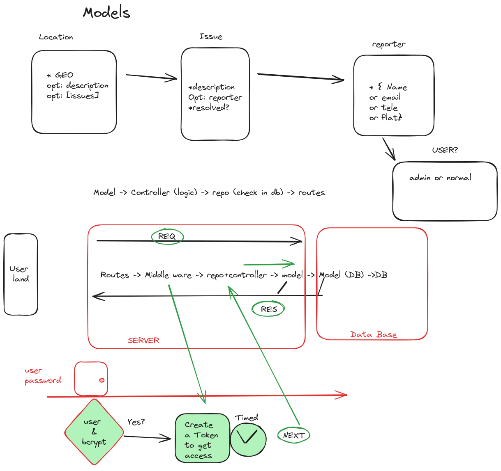

# RockTheCodeProyecto7

AUTH API RESTful CRUD learning

## Objective

Location is the key point. Each location can have several issues.

At some point it would be interesting to list all the issues that happen in the same location.
We should be able to list all the issues tied to a particular Court. (populate)
I should be able to see the list of issues that a particular User has done. (getIssuesByUser)

## Using the project

First a user must be created.
